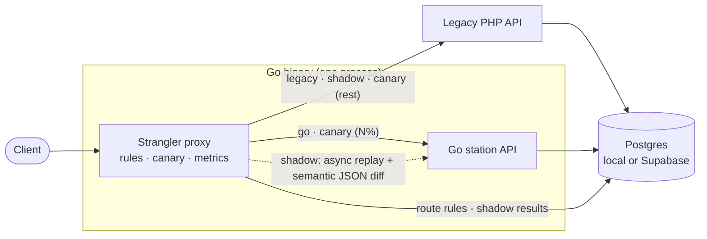

# radio-strangler

[](https://github.com/Zelezim/radio-strangler/actions/workflows/ci.yml)

Migrating a legacy PHP API to Go one route at a time, with zero downtime and proof at every step.

## The Strangler Fig pattern

Rewriting a live system in one go ("big bang") means a long freeze, a risky cutover and no way back.
The Strangler Fig pattern takes the opposite path: put a proxy in front of the legacy system and move
traffic to the new implementation **one route at a time**. Each route only advances when there is
evidence that the new code behaves like the old one, and any route can be rolled back instantly by
flipping its mode. Eventually the legacy system serves nothing and can be removed.

Here, a Go reverse proxy sits in front of a legacy PHP "station API" (online radio domain). The proxy
and the new Go API ship as a single binary; the PHP API runs as a separate service.

## Architecture



Every request is matched against a **route rule** stored in Postgres (reloaded every 5 seconds, or
immediately after an admin change) and sent to the backend its mode selects.

## Route modes

| Mode     | Who serves the client | What happens                                                                                       |
|----------|-----------------------|----------------------------------------------------------------------------------------------------|
| `legacy` | PHP                   | Plain pass-through to the legacy API. Starting point for every route.                              |
| `shadow` | PHP                   | The request is also replayed asynchronously against Go and both responses are compared. Users never see the Go response. |
| `canary` | PHP or Go             | N% of clients are routed to Go, selected by a deterministic FNV hash per client, so each client gets a consistent experience. |
| `go`     | Go                    | Migration done for this route. PHP no longer receives its traffic.                                 |

Every response carries `X-Served-By` (`legacy` or `go`) and `X-Route-Mode`, so the state of the
migration is visible from any client.

## Quick start (on-prem, docker compose)

Requirements: Docker with Compose v2, `curl` and `jq`. Go is only needed for the unit tests (1.22+)
and `make lint` (1.25+).

```bash
git clone https://github.com/Zelezim/radio-strangler.git
cd radio-strangler
docker compose up -d --build   # or: make up
./scripts/smoke.sh             # or: make smoke
```

This starts Postgres, the legacy PHP API (`:8081`) and the proxy (`:8080`) locally; it never talks
to Supabase. The smoke test walks through every stage (pass-through, shadow comparison, admin auth,
a live switch to Go with a contract diff, and the rollback) and ends with `✓ smoke test passed`.

The admin token defaults to `dev-admin-token`. Compose also reads a `.env` file in the project
directory if you have one, and `make smoke` resolves the token the same way. Port 8080 taken? Use
`APP_PORT=8090 docker compose up -d --build` and `BASE_URL=http://localhost:8090 ./scripts/smoke.sh`.

`make down` stops everything and deletes the local database.

## Demo: catching a real migration bug

The compose stack starts with `DEMO_INJECT_BUGS=true`, which makes the Go API reproduce the classic
PHP-to-Go bug: PHP's `json_encode(array())` is `[]`, but a nil Go slice encodes as `null`. Shadow mode
finds it on real traffic, without any client ever seeing it.

```bash
BASE=http://localhost:8080
AUTH="Authorization: Bearer dev-admin-token"
```

**1. `/api/tracks` is in shadow mode: PHP answers, Go is compared in the background.**

```bash
curl -s -o /dev/null -D - $BASE/api/tracks | grep -i '^x-'
```
```
X-Powered-By: PHP/8.3.35
X-Request-Id: 34e6bc647aabbfa3
X-Route-Mode: shadow
X-Served-By: legacy
```

**2. Shadow found a difference.**

```bash
curl -s -H "$AUTH" "$BASE/admin/comparisons?route=/api/tracks&mismatches=true&limit=1" \
  | jq '.data[0] | {match, diffs, legacy_ms, go_ms}'
```
```json
{
  "match": false,
  "diffs": ["$.data[2].tags: legacy=[] go=null"],
  "legacy_ms": 70,
  "go_ms": 3
}
```

**3. Ship the fix** (here: restart Go without the injected bug) **and watch the comparisons turn green.**

```bash
DEMO_INJECT_BUGS=false docker compose up -d app
curl -sf --retry 30 --retry-delay 1 --retry-all-errors -o /dev/null $BASE/readyz   # wait for the restart
curl -s -o /dev/null $BASE/api/tracks; sleep 1
curl -s -H "$AUTH" "$BASE/admin/comparisons?route=/api/tracks&limit=1" | jq '.data[0] | {match, diffs}'
curl -s -H "$AUTH" $BASE/admin/stats | jq '.data[] | select(.route == "/api/tracks")'
```

**4. Canary: 10% of clients on Go, always the same ones.**

```bash
curl -s -X PUT -H "$AUTH" -d '{"mode":"canary","canary_percent":10}' $BASE/admin/routes/api/tracks | jq -c .data
for i in $(seq 1 100); do
  curl -s -o /dev/null -D - -H "X-Client-ID: listener-$i" $BASE/api/tracks | grep -i '^x-served-by' | tr -d '\r'
done | sort | uniq -c
```
```
     10 X-Served-By: go
     90 X-Served-By: legacy
```

**5. Promote to Go.** The change applies on the next request: no deploy, no restart.

```bash
curl -s -X PUT -H "$AUTH" -d '{"mode":"go"}' $BASE/admin/routes/api/tracks | jq -c .data
curl -s -o /dev/null -D - $BASE/api/tracks | grep -i '^x-served-by'
```

**6. Roll back** just as fast if anything looks wrong.

```bash
curl -s -X PUT -H "$AUTH" -d '{"mode":"shadow"}' $BASE/admin/routes/api/tracks | jq -c .data
curl -s -o /dev/null -D - $BASE/api/tracks | grep -i '^x-served-by'
```

## Admin API

All `/admin/*` endpoints require `Authorization: Bearer <ADMIN_TOKEN>` (401 otherwise). With
`ADMIN_TOKEN` empty the admin API is disabled and every path returns 404.

| Method | Path | Description |
|--------|------|-------------|
| `GET`  | `/admin/routes` | All route rules. |
| `PUT`  | `/admin/routes/{route}` | Create or change a rule, e.g. `PUT /admin/routes/api/tracks` with `{"mode":"canary","canary_percent":10}`. `go` forces `canary_percent` to 100; omitting `ignore_fields` keeps the current list. Applied immediately. |
| `GET`  | `/admin/comparisons` | Latest shadow comparisons. Query: `route`, `mismatches=true`, `limit` (default 50, max 500). |
| `GET`  | `/admin/stats` | Last 24h per route: total, matched, errors, `match_rate`, p95 latency of legacy vs Go, last seen. |

Public operational endpoints:

| Method | Path | Description |
|--------|------|-------------|
| `GET`  | `/healthz` | Liveness: the process is up (does not touch the database). |
| `GET`  | `/readyz` | Readiness: runs a real query; 503 if the database is unavailable. |
| `GET`  | `/metrics` | Prometheus text format: `proxy_requests_total`, `proxy_request_duration_seconds`, `shadow_comparisons_total`. |

## Design decisions

- **Semantic JSON diff, not bytes.** PHP escapes `/` and non-ASCII, Go escapes `<>&`, key order differs
  and `1` equals `1.0`. Responses are decoded (numbers kept exact) and compared value by value; each
  difference becomes a readable path such as `$.data[2].tags: legacy=[] go=null`. Volatile fields
  (`generated_at`) are ignored per route, at any depth.
- **Only GET is shadowed.** Replaying a POST would execute the write twice, once per implementation,
  against the same database.
- **Shadow can never hurt the client.** The job is queued after the legacy response is sent; the queue
  is bounded and a fixed pool of workers consumes it. When it is full the job is dropped and counted
  (`shadow_comparisons_total{outcome="dropped"}`) instead of blocking. A panic in the new code is
  recovered and recorded as an error. The replayed request is detached from the client's
  cancellation, so a client disconnecting does not abort the comparison.
- **Unknown routes go to legacy.** A path without a rule is always served by PHP: a route only moves
  to Go by an explicit decision, never by omission. Prefix matching respects segment boundaries
  (`/api/tracks` covers `/api/tracks/42`, not `/api/tracksearch`).
- **Deterministic canary.** `FNV-32a(client) % 100 < percent`: no shared state between replicas, the
  same client always lands on the same side, and raising the percentage only adds clients to Go.
- **Metric labels use the rule's route, never the raw path.** Paths carry ids and bot scans; one label
  per distinct path would grow the number of series without bound.
- **Migrations under an advisory lock.** SQL files embedded in the binary, applied at startup, each in
  a transaction, guarded by `pg_advisory_lock` so several replicas booting together migrate once.
  This is also why the Supabase *session* pooler is required.
- **Built for the free plan.** One binary for proxy and Go API (one Render service instead of two), a
  small connection pool, generous legacy and connect timeouts for cold starts, retention of shadow
  data (7 days by default) and a keepalive workflow.
- **Minimal dependencies.** Standard library plus `github.com/lib/pq`. No framework, no ORM; the
  Prometheus exposition format is written by hand rather than pulling in the client library.

## Cloud deployment (Render + Supabase)

1. **Database:** a Supabase project. Use the **Session pooler** connection string (port **5432**),
   with `?sslmode=require`. Not the transaction pooler (6543): the advisory lock and session state
   need a stable session. Not the direct `db.<ref>.supabase.co` host either: it is IPv6-only.
2. **Services:** on Render, *New → Blueprint* and select this repository. `render.yaml` creates
   `radio-strangler` (proxy + Go API) and `radio-legacy-php`, both on the free plan.
3. **Configuration:** set `DATABASE_URL` on both services and, on `radio-strangler`, `LEGACY_URL` to
   the public URL of `radio-legacy-php`. `ADMIN_TOKEN` is generated by Render; keep it in a
   password manager.
4. **Keepalive:** in GitHub, add the repository variable `APP_URL` (Settings → Secrets and variables
   → Actions → Variables) with the URL of `radio-strangler`, then run the *Keepalive* workflow once.
5. **Verify:** `BASE_URL=<render-url> ADMIN_TOKEN=<token> ./scripts/smoke.sh`.

### Free plan limitations

- Render spins a free service down after 15 minutes without traffic; the next request waits for a
  cold start of about a minute (the proxy's timeouts are sized for it).
- Supabase pauses a free project after 7 days without activity. The keepalive runs every 3 days and
  hits `/readyz`, which wakes Render and runs a real query.
- GitHub disables scheduled workflows in public repositories after 60 days without repository
  activity; re-enable *Keepalive* in the Actions tab if that happens.

## Configuration

| Variable | Default | Description |
|----------|---------|-------------|
| `PORT` | `8080` | HTTP port of the proxy. |
| `DATABASE_URL` | *(required)* | Postgres URL. Supabase: session pooler, port 5432, `sslmode=require`. |
| `LEGACY_URL` | *(required)* | Base URL of the legacy PHP API. |
| `ADMIN_TOKEN` | *(empty)* | Bearer token for `/admin`. Empty disables the admin API. |
| `LEGACY_TIMEOUT` | `60s` | Max wait for legacy response headers (covers cold starts). |
| `RULES_REFRESH` | `5s` | Periodic reload of route rules. |
| `SHADOW_WORKERS` | `4` | Shadow worker goroutines. |
| `SHADOW_QUEUE` | `100` | Shadow queue size; beyond it jobs are dropped and counted. |
| `SHADOW_TIMEOUT` | `5s` | Max time for one Go replay. |
| `SHADOW_RETENTION` | `168h` | Age after which shadow comparisons are purged (hourly). |
| `DEMO_INJECT_BUGS` | `false` | Demo only: Go returns `null` instead of `[]` for empty tags. |
| `LOG_LEVEL` | `info` | `debug`, `info`, `warn` or `error`. |

Configuration errors are all reported at once at startup, and `DATABASE_URL` is never echoed in them.
docker compose additionally accepts `APP_PORT` and `LEGACY_PORT` for the published ports.

## Project layout

```
cmd/server/          main: wiring, HTTP server, graceful shutdown, retention loop
internal/
  admin/             control plane: route rules, comparisons, stats (bearer auth)
  api/               Go implementation of the station API (same contract as PHP)
  config/            environment loading and validation
  diff/              semantic JSON comparison
  httpx/             middleware: request id, access log, panic recovery
  metrics/           Prometheus text-format registry
  proxy/             the strangler facade: rule match, backend choice, shadow capture
  radio/             domain types; their JSON tags are the public contract
  routing/           modes, rules, canary hashing, lock-free rule table and loader
  shadow/            bounded async replay of requests against Go
  store/             Postgres access and embedded migrations
legacy-php/          the legacy API (deliberately old-style procedural PHP) and its Dockerfile
scripts/smoke.sh     end-to-end test against any running deployment
```

## Testing

```bash
make test    # go test -race -count=1 ./...
make lint    # gofmt, go vet, staticcheck
make smoke   # end-to-end against BASE_URL (default: the local compose stack)
```

CI runs lint and unit tests on every push and pull request, then starts the full compose stack and
runs the smoke test against it.

## Next steps

- **Dry-run for writes:** shadow non-GET routes by executing the Go side inside a transaction that is
  always rolled back.
- **Sampling:** shadow only a percentage of requests on high-traffic routes.
- **Dashboard:** a small page over `/admin/stats` and `/admin/comparisons` to follow each route's
  migration.
- **OpenTelemetry:** traces spanning proxy, legacy call and shadow replay, correlated by request id.

## License

[MIT](LICENSE)
